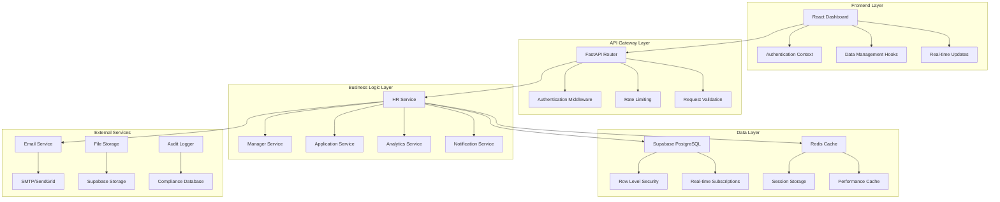

# Design Document

## Overview

The HR Manager System Consolidation design provides a comprehensive solution that builds upon the existing functional foundation while addressing identified gaps and implementing new capabilities. The design focuses on enhancing the current Supabase-based architecture with improved performance, security, and user experience.

## Architecture

### Current Architecture Assessment

**Existing Foundation (Working Well):**
- **Backend**: FastAPI with Supabase PostgreSQL integration
- **Frontend**: React 18 with TypeScript, Tailwind CSS, and shadcn/ui components
- **Authentication**: JWT-based with role-based access control
- **Database**: Supabase PostgreSQL with Row Level Security (RLS)
- **State Management**: React Context API with custom hooks

**Architecture Enhancements:**
- **Caching Layer**: Redis for performance optimization
- **Event System**: Real-time updates with Supabase Realtime
- **Notification Service**: Email and in-app notification system
- **Analytics Engine**: Advanced reporting and metrics processing
- **Audit System**: Comprehensive activity logging and compliance tracking

### Enhanced System Architecture



## Components and Interfaces

### 1. Enhanced HR Dashboard System

#### HR Dashboard Layout Component
```typescript
interface HRDashboardProps {
  user: User
  initialTab?: string
}

interface HRDashboardState {
  activeTab: string
  stats: DashboardStats
  notifications: Notification[]
  loading: boolean
  error: string | null
}

interface DashboardStats {
  totalProperties: number
  totalManagers: number
  totalEmployees: number
  pendingApplications: number
  talentPoolSize: number
  monthlyHires: number
  averageTimeToHire: number
  managerPerformanceScore: number
}
```

**Enhanced Features:**
- Real-time dashboard statistics with automatic updates
- Notification center with priority alerts
- Quick action shortcuts for common tasks
- Performance metrics with trend indicators
- Customizable dashboard layout with widget management

#### Advanced Property Management Component
```typescript
interface PropertyManagementProps {
  onStatsUpdate: () => void
}

interface PropertyWithMetrics extends Property {
  metrics: {
    totalApplications: number
    activeEmployees: number
    managerPerformance: number
    averageTimeToHire: number
    talentPoolSize: number
  }
  manager: Manager | null
  recentActivity: ActivityLog[]
}

interface PropertyBulkOperations {
  selectedProperties: string[]
  bulkAction: 'assign_manager' | 'update_status' | 'generate_reports'
  actionData: Record<string, any>
}
```

**Enhanced Features:**
- Property performance metrics and analytics
- Bulk property operations with progress tracking
- Manager assignment workflow with validation
- Property activity timeline and audit logs
- Advanced search with saved filters

#### Comprehensive Manager Management Component
```typescript
interface ManagerManagementProps {
  onStatsUpdate: () => void
}

interface ManagerWithPerformance extends Manager {
  performance: {
    totalApplicationsReviewed: number
    approvalRate: number
    averageReviewTime: number
    employeeSatisfactionScore: number
    propertyPerformanceRank: number
  }
  currentWorkload: {
    pendingApplications: number
    activeEmployees: number
    overdueReviews: number
  }
  activityHistory: ActivityLog[]
}

interface ManagerBulkOperations {
  selectedManagers: string[]
  bulkAction: 'reassign_property' | 'update_permissions' | 'send_notification'
  actionData: Record<string, any>
}
```

**Enhanced Features:**
- Manager performance dashboard with KPIs
- Workload balancing and assignment optimization
- Performance coaching recommendations
- Bulk manager operations with audit trails
- Manager communication and notification system

### 2. Enhanced Manager Dashboard System

#### Manager Dashboard Layout Component
```typescript
interface ManagerDashboardProps {
  user: User
  property: Property
}

interface ManagerDashboardState {
  property: PropertyWithMetrics
  workloadSummary: WorkloadSummary
  recentActivity: ActivityLog[]
  notifications: Notification[]
  quickActions: QuickAction[]
}

interface WorkloadSummary {
  pendingApplications: number
  activeEmployees: number
  overdueReviews: number
  upcomingDeadlines: number
  performanceScore: number
  weeklyGoals: Goal[]
}
```

**Enhanced Features:**
- Property-specific performance dashboard
- Workload management with priority indicators
- Goal tracking and achievement metrics
- Quick action buttons for common tasks
- Contextual help and guidance system

#### Advanced Application Review Component
```typescript
interface ApplicationReviewProps {
  userRole: 'manager'
  propertyId: string
}

interface ApplicationWithInsights extends JobApplication {
  insights: {
    similarCandidates: JobApplication[]
    skillsMatch: number
    experienceLevel: string
    recommendedAction: 'approve' | 'reject' | 'interview'
    riskFactors: string[]
  }
  timeline: ApplicationEvent[]
  documents: Document[]
  assessments: Assessment[]
}

interface ReviewWorkflow {
  currentStep: 'initial_review' | 'detailed_review' | 'decision' | 'job_offer'
  completedSteps: string[]
  nextActions: Action[]
  estimatedTimeToComplete: number
}
```

**Enhanced Features:**
- AI-powered candidate insights and recommendations
- Structured review workflow with progress tracking
- Document management and verification system
- Interview scheduling and assessment tools
- Automated job offer generation with templates

### 3. Advanced Application Lifecycle Management

#### Application Processing Engine
```typescript
interface ApplicationProcessor {
  processApplication(application: JobApplication): Promise<ProcessingResult>
  routeToManager(application: JobApplication): Promise<RoutingResult>
  generateInsights(application: JobApplication): Promise<ApplicationInsights>
  updateStatus(applicationId: string, status: ApplicationStatus, metadata: any): Promise<void>
}

interface ProcessingResult {
  success: boolean
  applicationId: string
  assignedManager: string
  priority: 'high' | 'medium' | 'low'
  estimatedReviewTime: number
  automatedChecks: CheckResult[]
}

interface TalentPoolManager {
  addToTalentPool(application: JobApplication, reason: string): Promise<void>
  searchTalentPool(criteria: SearchCriteria): Promise<TalentPoolCandidate[]>
  reactivateCandidate(candidateId: string): Promise<void>
  bulkNotifyTalentPool(candidateIds: string[], message: string): Promise<void>
}
```

**Enhanced Features:**
- Automated application routing and prioritization
- Intelligent candidate matching and recommendations
- Comprehensive talent pool management
- Bulk operations with progress tracking and rollback
- Advanced search and filtering capabilities

### 4. Real-time Notification System

#### Notification Service Architecture
```typescript
interface NotificationService {
  sendNotification(notification: NotificationRequest): Promise<void>
  subscribeToEvents(userId: string, eventTypes: string[]): Promise<void>
  getNotificationHistory(userId: string): Promise<Notification[]>
  updatePreferences(userId: string, preferences: NotificationPreferences): Promise<void>
}

interface NotificationRequest {
  recipientId: string
  type: NotificationType
  priority: 'low' | 'medium' | 'high' | 'urgent'
  title: string
  message: string
  actionUrl?: string
  metadata: Record<string, any>
}

interface NotificationPreferences {
  email: boolean
  inApp: boolean
  sms: boolean
  eventTypes: Record<string, boolean>
  quietHours: { start: string; end: string }
  frequency: 'immediate' | 'hourly' | 'daily'
}
```

**Enhanced Features:**
- Multi-channel notification delivery (email, in-app, SMS)
- User-customizable notification preferences
- Priority-based notification routing
- Notification history and acknowledgment tracking
- Template management for consistent messaging

### 5. Advanced Analytics and Reporting

#### Analytics Engine
```typescript
interface AnalyticsEngine {
  generateDashboard(userId: string, role: UserRole): Promise<Dashboard>
  createReport(reportConfig: ReportConfig): Promise<Report>
  scheduleReport(reportConfig: ReportConfig, schedule: Schedule): Promise<void>
  exportData(exportConfig: ExportConfig): Promise<ExportResult>
}

interface Dashboard {
  widgets: Widget[]
  metrics: Metric[]
  charts: Chart[]
  alerts: Alert[]
  lastUpdated: Date
}

interface ReportConfig {
  type: 'hiring_funnel' | 'manager_performance' | 'property_analytics' | 'compliance_audit'
  dateRange: DateRange
  filters: Record<string, any>
  format: 'pdf' | 'excel' | 'csv' | 'json'
  recipients: string[]
}
```

**Enhanced Features:**
- Role-based analytics dashboards
- Customizable report generation and scheduling
- Interactive data visualization with drill-down capabilities
- Automated compliance reporting
- Performance benchmarking and trend analysis

## Data Models

### Enhanced User Model
```typescript
interface User {
  id: string
  email: string
  first_name: string
  last_name: string
  role: UserRole
  property_id?: string
  permissions: Permission[]
  preferences: UserPreferences
  last_login: Date
  is_active: boolean
  created_at: Date
  updated_at: Date
}

interface UserPreferences {
  theme: 'light' | 'dark' | 'auto'
  language: string
  timezone: string
  notifications: NotificationPreferences
  dashboard: DashboardPreferences
}
```

### Enhanced Property Model
```typescript
interface Property {
  id: string
  name: string
  address: string
  city: string
  state: string
  zip_code: string
  phone?: string
  email?: string
  website?: string
  manager_ids: string[]
  qr_code_url: string
  settings: PropertySettings
  metrics: PropertyMetrics
  is_active: boolean
  created_at: Date
  updated_at: Date
}

interface PropertySettings {
  hiring_workflow: WorkflowConfig
  notification_settings: NotificationConfig
  branding: BrandingConfig
  compliance_requirements: ComplianceConfig
}
```

### Enhanced Application Model
```typescript
interface JobApplication {
  id: string
  property_id: string
  department: string
  position: string
  applicant_data: ApplicantData
  status: ApplicationStatus
  priority: Priority
  assigned_manager: string
  review_data: ReviewData
  timeline: ApplicationEvent[]
  documents: Document[]
  metadata: ApplicationMetadata
  applied_at: Date
  updated_at: Date
}

interface ReviewData {
  manager_notes: string
  hr_notes: string
  interview_feedback: InterviewFeedback[]
  assessments: Assessment[]
  decision_reason: string
  job_offer: JobOffer
}
```

## Error Handling

### Comprehensive Error Management System

#### Frontend Error Handling
```typescript
interface ErrorBoundary {
  componentDidCatch(error: Error, errorInfo: ErrorInfo): void
  render(): React.ReactNode
}

interface ErrorHandler {
  handleApiError(error: AxiosError): void
  handleValidationError(errors: ValidationError[]): void
  handleNetworkError(error: NetworkError): void
  showUserFriendlyMessage(error: Error): void
}

interface ErrorRecovery {
  retryOperation(operation: () => Promise<any>, maxRetries: number): Promise<any>
  fallbackToCache(key: string): any
  gracefulDegradation(feature: string): void
}
```

**Enhanced Features:**
- Automatic error recovery with retry mechanisms
- User-friendly error messages with suggested actions
- Graceful degradation for non-critical features
- Error reporting and analytics for system improvement
- Context-aware error handling based on user role and action

#### Backend Error Handling
```typescript
interface ErrorResponse {
  error: {
    code: string
    message: string
    details?: any
    timestamp: Date
    requestId: string
  }
  success: false
}

interface ErrorLogger {
  logError(error: Error, context: ErrorContext): void
  trackErrorMetrics(error: Error): void
  alertOnCriticalError(error: Error): void
}

interface ErrorContext {
  userId?: string
  endpoint: string
  method: string
  parameters: any
  userAgent: string
  ipAddress: string
}
```

**Enhanced Features:**
- Structured error responses with consistent format
- Comprehensive error logging and monitoring
- Automatic alerting for critical system errors
- Error analytics and trend analysis
- Security-focused error handling to prevent information leakage

## Testing Strategy

### Comprehensive Testing Approach

#### Unit Testing
- **Component Testing**: React Testing Library for all UI components
- **Service Testing**: Jest for business logic and API services
- **Hook Testing**: Custom hook testing with React Hooks Testing Library
- **Utility Testing**: Pure function testing with comprehensive edge cases

#### Integration Testing
- **API Integration**: End-to-end API testing with real database
- **Authentication Flow**: Complete auth workflow testing
- **Role-based Access**: Permission and access control testing
- **Database Operations**: Supabase integration testing with test database

#### End-to-End Testing
- **User Workflows**: Complete user journey testing with Playwright
- **Cross-browser Testing**: Chrome, Firefox, Safari compatibility
- **Mobile Testing**: Responsive design and touch interaction testing
- **Performance Testing**: Load testing and performance benchmarking

#### Security Testing
- **Authentication Security**: JWT token validation and security
- **Authorization Testing**: Role-based access control verification
- **Input Validation**: SQL injection and XSS prevention testing
- **Data Privacy**: PII handling and encryption testing

## Performance Considerations

### Frontend Performance Optimization

#### Code Splitting and Lazy Loading
```typescript
const HRDashboard = lazy(() => import('./pages/HRDashboard'))
const ManagerDashboard = lazy(() => import('./pages/ManagerDashboard'))
const ApplicationsTab = lazy(() => import('./components/ApplicationsTab'))
```

#### State Management Optimization
```typescript
interface OptimizedState {
  cache: Map<string, CacheEntry>
  subscriptions: Set<string>
  pendingRequests: Map<string, Promise<any>>
}

interface CacheEntry {
  data: any
  timestamp: Date
  ttl: number
}
```

#### Virtual Scrolling for Large Datasets
```typescript
interface VirtualizedTable {
  itemHeight: number
  containerHeight: number
  overscan: number
  renderItem: (index: number, item: any) => React.ReactNode
}
```

### Backend Performance Optimization

#### Database Query Optimization
```sql
-- Optimized indexes for common queries
CREATE INDEX CONCURRENTLY idx_applications_property_status 
ON job_applications(property_id, status) 
WHERE status IN ('pending', 'approved');

CREATE INDEX CONCURRENTLY idx_employees_property_active 
ON employees(property_id, employment_status) 
WHERE employment_status = 'active';
```

#### Caching Strategy
```typescript
interface CacheStrategy {
  redis: RedisClient
  localCache: Map<string, any>
  cacheKey(operation: string, params: any): string
  invalidateCache(pattern: string): Promise<void>
}
```

#### Connection Pooling
```typescript
interface DatabasePool {
  maxConnections: number
  idleTimeout: number
  connectionTimeout: number
  retryAttempts: number
}
```

## Security Considerations

### Enhanced Security Architecture

#### Authentication and Authorization
```typescript
interface SecurityConfig {
  jwtSecret: string
  tokenExpiration: number
  refreshTokenExpiration: number
  maxLoginAttempts: number
  lockoutDuration: number
}

interface RoleBasedAccess {
  roles: Role[]
  permissions: Permission[]
  resourceAccess: ResourceAccess[]
}
```

#### Data Protection
```typescript
interface DataProtection {
  encryptionKey: string
  hashingAlgorithm: string
  saltRounds: number
  piiFields: string[]
}

interface AuditLogging {
  logLevel: 'info' | 'warn' | 'error'
  sensitiveFields: string[]
  retentionPeriod: number
  complianceRequirements: string[]
}
```

#### Security Monitoring
```typescript
interface SecurityMonitoring {
  failedLoginThreshold: number
  suspiciousActivityPatterns: Pattern[]
  alertingRules: AlertRule[]
  incidentResponse: ResponsePlan
}
```

**Enhanced Security Features:**
- Multi-factor authentication support
- Session management with automatic timeout
- Rate limiting and DDoS protection
- Comprehensive audit logging for compliance
- Real-time security monitoring and alerting
- Data encryption at rest and in transit
- Regular security assessments and penetration testing