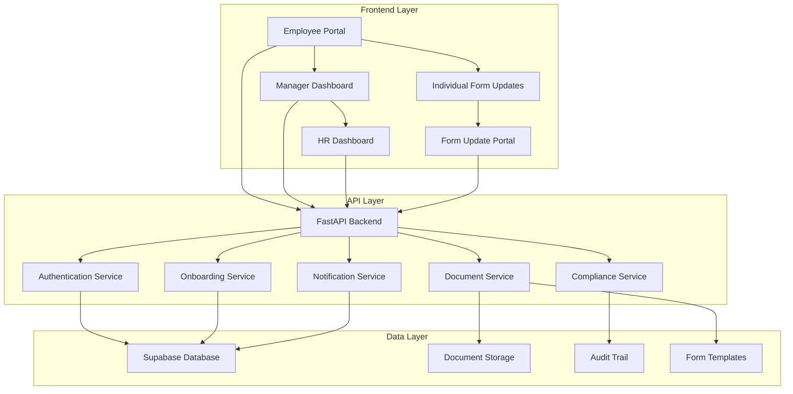
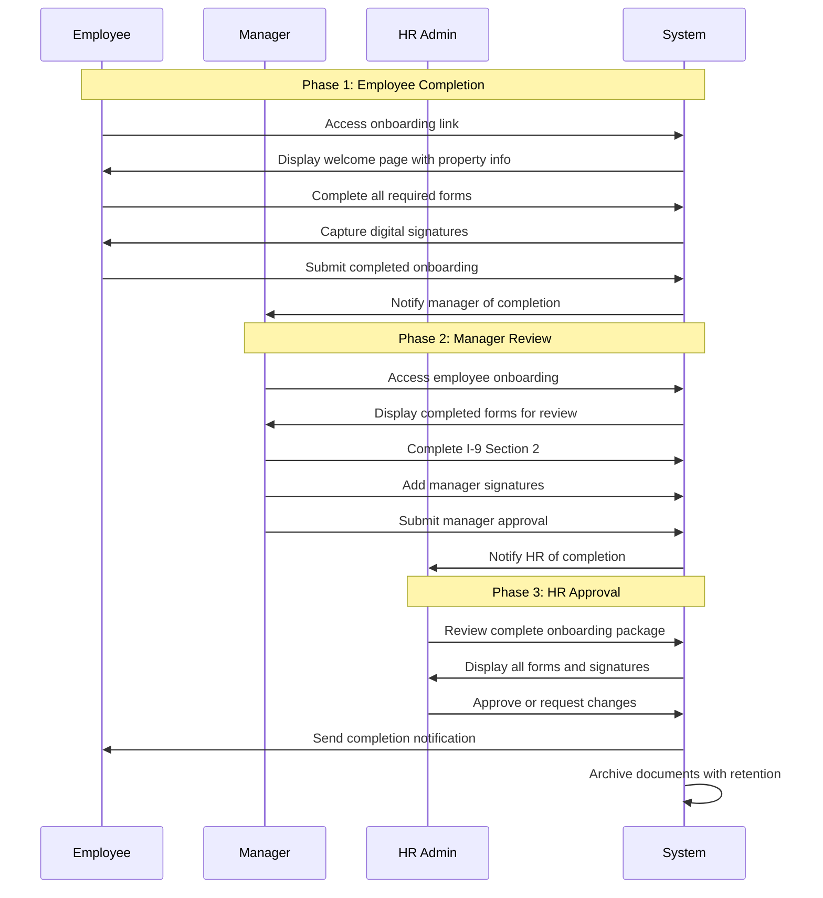

# Modular Employee Onboarding System - Design Document

## Overview

This design document outlines the architecture for a comprehensive, modular employee onboarding system that digitizes all 28 pages of the hotel onboarding packet while maintaining federal compliance and supporting individual form updates. The system follows a three-phase workflow: Employee Completion → Manager Review → HR Approval.

## Architecture

### System Architecture Diagram



### Three-Phase Workflow



## Components and Interfaces

### 1. Onboarding Orchestrator Service

**Purpose:** Manages the complete onboarding workflow and state transitions.

**Key Methods:**
```python
class OnboardingOrchestrator:
    def initiate_onboarding(self, application_id: str) -> OnboardingSession
    def get_next_step(self, session_id: str) -> OnboardingStep
    def complete_step(self, session_id: str, step: OnboardingStep, data: Dict) -> bool
    def transition_to_manager_review(self, session_id: str) -> bool
    def transition_to_hr_approval(self, session_id: str) -> bool
    def approve_onboarding(self, session_id: str, hr_user_id: str) -> bool
    def send_form_update(self, employee_id: str, form_type: str) -> str
```

**State Management:**
- Tracks current step in onboarding process
- Manages transitions between employee/manager/HR phases
- Handles form completion validation
- Maintains audit trail of all actions

### 2. Modular Form System

**Purpose:** Provides individual form components that can be used in full onboarding or standalone updates.

**Form Components:**
```typescript
interface FormComponent {
  id: string
  type: FormType
  title: string
  description: string
  fields: FormField[]
  validation: ValidationRules
  dependencies: string[]
  isRequired: boolean
  canUpdateIndividually: boolean
}

enum FormType {
  PERSONAL_INFO = "personal_info",
  W4_FORM = "w4_form",
  I9_SECTION1 = "i9_section1",
  DIRECT_DEPOSIT = "direct_deposit",
  EMERGENCY_CONTACTS = "emergency_contacts",
  HEALTH_INSURANCE = "health_insurance",
  COMPANY_POLICIES = "company_policies",
  TRAFFICKING_AWARENESS = "trafficking_awareness",
  WEAPONS_POLICY = "weapons_policy",
  BACKGROUND_CHECK = "background_check"
}
```

**Individual Form Update System:**
```python
class FormUpdateService:
    def generate_update_link(self, employee_id: str, form_type: FormType) -> str
    def validate_update_token(self, token: str) -> UpdateSession
    def get_current_form_data(self, employee_id: str, form_type: FormType) -> Dict
    def save_form_update(self, session_id: str, form_data: Dict) -> bool
    def notify_completion(self, employee_id: str, form_type: FormType) -> bool
```

### 3. Official Form Integration Service

**Purpose:** Handles mapping between user data and official government forms (I-9, W-4).

**I-9 Form Integration:**
```python
class I9FormService:
    def map_employee_data_to_i9(self, employee_data: Dict) -> I9Section1Data
    def generate_i9_section1_pdf(self, data: I9Section1Data) -> bytes
    def create_manager_section2_interface(self, employee_i9: I9Section1Data) -> I9Section2Form
    def validate_document_verification(self, documents: List[Document]) -> bool
    def generate_complete_i9_pdf(self, section1: I9Section1Data, section2: I9Section2Data) -> bytes
```

**W-4 Form Integration:**
```python
class W4FormService:
    def map_employee_data_to_w4(self, employee_data: Dict) -> W4FormData
    def calculate_tax_withholding(self, w4_data: W4FormData) -> TaxCalculation
    def generate_w4_pdf(self, data: W4FormData) -> bytes
    def handle_multi_job_worksheet(self, w4_data: W4FormData) -> MultiJobWorksheet
```

### 4. Manager Interface Service

**Purpose:** Provides manager-specific interfaces for completing required sections.

**Manager Dashboard:**
```typescript
interface ManagerOnboardingView {
  employee: Employee
  completedForms: FormSummary[]
  requiredActions: ManagerAction[]
  i9Section2: I9Section2Interface
  approvalStatus: ApprovalStatus
}

interface I9Section2Interface {
  employeeSection1: I9Section1Data
  documentVerification: DocumentVerificationForm
  employerAttestation: EmployerAttestationForm
  signatureCapture: DigitalSignatureInterface
}
```

**Manager Actions:**
```python
class ManagerActionService:
    def get_pending_onboardings(self, manager_id: str) -> List[OnboardingSession]
    def review_employee_forms(self, session_id: str) -> EmployeeFormSummary
    def complete_i9_section2(self, session_id: str, section2_data: I9Section2Data) -> bool
    def verify_employee_documents(self, session_id: str, documents: List[Document]) -> bool
    def add_manager_signatures(self, session_id: str, signatures: List[Signature]) -> bool
    def submit_manager_approval(self, session_id: str, approval: ManagerApproval) -> bool
```

### 5. HR Review and Approval Service

**Purpose:** Provides HR administrators with comprehensive review and approval capabilities.

**HR Dashboard:**
```typescript
interface HROnboardingView {
  employee: Employee
  manager: Manager
  completedForms: ComprehensiveFormSummary
  complianceChecklist: ComplianceItem[]
  auditTrail: AuditEntry[]
  approvalActions: HRAction[]
}
```

**HR Actions:**
```python
class HRApprovalService:
    def get_pending_approvals(self, hr_user_id: str) -> List[OnboardingSession]
    def review_complete_package(self, session_id: str) -> OnboardingPackageReview
    def validate_compliance(self, session_id: str) -> ComplianceValidationResult
    def request_form_correction(self, session_id: str, form_type: FormType, notes: str) -> bool
    def approve_onboarding(self, session_id: str, hr_approval: HRApproval) -> bool
    def generate_completion_certificate(self, session_id: str) -> bytes
```

### 6. Notification and Communication Service

**Purpose:** Manages all email notifications and system communications.

**Notification Types:**
```python
class NotificationService:
    def send_onboarding_welcome(self, employee_email: str, onboarding_link: str) -> bool
    def notify_manager_review_required(self, manager_email: str, employee_name: str) -> bool
    def notify_hr_approval_required(self, hr_email: str, employee_name: str) -> bool
    def send_form_update_request(self, employee_email: str, form_type: FormType, update_link: str) -> bool
    def send_completion_notification(self, employee_email: str, completion_certificate: bytes) -> bool
    def send_correction_request(self, recipient_email: str, form_type: FormType, notes: str) -> bool
```

## Data Models

### Enhanced Onboarding Session Model

```python
class OnboardingSession(BaseModel):
    id: str
    application_id: str
    employee_id: str
    manager_id: str
    property_id: str
    status: OnboardingStatus
    current_step: OnboardingStep
    started_at: datetime
    employee_completed_at: Optional[datetime]
    manager_completed_at: Optional[datetime]
    hr_approved_at: Optional[datetime]
    expires_at: datetime
    
    # Form completion tracking
    completed_forms: Dict[FormType, FormCompletionData]
    required_signatures: Dict[SignatureType, SignatureData]
    uploaded_documents: Dict[DocumentType, DocumentData]
    
    # Workflow tracking
    phase: OnboardingPhase  # EMPLOYEE, MANAGER, HR
    notifications_sent: List[NotificationRecord]
    audit_trail: List[AuditEntry]
    
    # Compliance tracking
    federal_compliance_checks: Dict[str, ComplianceCheck]
    retention_policy: DocumentRetentionPolicy
```

### Form Update Session Model

```python
class FormUpdateSession(BaseModel):
    id: str
    employee_id: str
    form_type: FormType
    update_token: str
    requested_by: str  # HR user ID
    requested_at: datetime
    expires_at: datetime
    completed_at: Optional[datetime]
    
    # Current and updated data
    current_data: Dict[str, Any]
    updated_data: Optional[Dict[str, Any]]
    change_reason: str
    
    # Approval workflow
    requires_manager_approval: bool
    manager_approved_at: Optional[datetime]
    hr_approved_at: Optional[datetime]
    
    # Audit trail
    audit_trail: List[AuditEntry]
```

### Comprehensive Employee Model

```python
class Employee(BaseModel):
    id: str
    application_id: str
    property_id: str
    
    # Personal Information
    personal_info: PersonalInformation
    emergency_contacts: List[EmergencyContact]
    
    # Employment Information
    job_details: JobDetails
    compensation: CompensationDetails
    
    # Government Forms
    i9_data: I9FormData
    w4_data: W4FormData
    
    # Benefits and Policies
    health_insurance: HealthInsuranceSelection
    direct_deposit: DirectDepositInfo
    policy_acknowledgments: Dict[str, PolicyAcknowledgment]
    
    # Training and Compliance
    trafficking_awareness_completed: bool
    background_check_authorized: bool
    weapons_policy_acknowledged: bool
    
    # Status and Workflow
    onboarding_status: OnboardingStatus
    onboarding_session_id: Optional[str]
    hired_at: Optional[datetime]
    
    # Document Management
    uploaded_documents: Dict[DocumentType, DocumentMetadata]
    signatures: Dict[SignatureType, SignatureMetadata]
    
    # Audit and Compliance
    created_at: datetime
    updated_at: datetime
    compliance_audit_trail: List[ComplianceAuditEntry]
```

## Error Handling

### Validation and Error Management

```python
class OnboardingError(Exception):
    def __init__(self, message: str, error_code: str, form_type: Optional[FormType] = None):
        self.message = message
        self.error_code = error_code
        self.form_type = form_type
        super().__init__(self.message)

class ValidationError(OnboardingError):
    def __init__(self, field: str, message: str, form_type: FormType):
        super().__init__(f"Validation error in {field}: {message}", "VALIDATION_ERROR", form_type)
        self.field = field

class ComplianceError(OnboardingError):
    def __init__(self, requirement: str, message: str):
        super().__init__(f"Compliance violation: {requirement} - {message}", "COMPLIANCE_ERROR")
        self.requirement = requirement
```

### Error Recovery Strategies

1. **Form Validation Errors:** Return specific field errors with correction guidance
2. **Document Upload Errors:** Provide retry mechanism with format guidance
3. **Signature Capture Errors:** Allow re-capture with device compatibility checks
4. **Network Errors:** Implement auto-save and resume functionality
5. **Compliance Errors:** Escalate to HR with detailed compliance guidance

## Testing Strategy

### Unit Testing

```python
class TestOnboardingOrchestrator:
    def test_initiate_onboarding_creates_session(self):
        # Test onboarding session creation
        pass
    
    def test_step_completion_advances_workflow(self):
        # Test workflow progression
        pass
    
    def test_manager_transition_requires_employee_completion(self):
        # Test phase transition validation
        pass

class TestFormUpdateService:
    def test_generate_update_link_creates_secure_token(self):
        # Test secure token generation
        pass
    
    def test_form_update_preserves_other_data(self):
        # Test data isolation in updates
        pass
```

### Integration Testing

```python
class TestCompleteOnboardingWorkflow:
    def test_end_to_end_onboarding_flow(self):
        # Test complete employee → manager → HR workflow
        pass
    
    def test_individual_form_update_workflow(self):
        # Test standalone form update process
        pass
    
    def test_compliance_validation_throughout_process(self):
        # Test federal compliance at each step
        pass
```

### Compliance Testing

```python
class TestFederalCompliance:
    def test_i9_form_matches_official_template(self):
        # Verify I-9 PDF output matches USCIS template
        pass
    
    def test_w4_form_matches_official_template(self):
        # Verify W-4 PDF output matches IRS template
        pass
    
    def test_digital_signatures_meet_esign_requirements(self):
        # Verify ESIGN Act compliance
        pass
    
    def test_document_retention_policies(self):
        # Verify proper document retention
        pass
```

## Security Considerations

### Authentication and Authorization

1. **JWT Token Security:** Short-lived tokens with refresh mechanism
2. **Role-Based Access Control:** Strict separation of employee/manager/HR permissions
3. **Form Update Security:** Time-limited, single-use tokens for individual form updates
4. **Document Access Control:** Encrypted storage with audit logging

### Data Protection

1. **PII Encryption:** All personally identifiable information encrypted at rest
2. **Secure Transmission:** HTTPS/TLS for all data transmission
3. **Access Logging:** Comprehensive audit trail of all data access
4. **Data Retention:** Automated compliance with federal retention requirements

### Compliance Security

1. **ESIGN Act Compliance:** Legally valid digital signatures with proper consent
2. **FCRA Compliance:** Proper disclosure and consent for background checks
3. **State Law Compliance:** Dynamic compliance based on work location
4. **Audit Trail Integrity:** Tamper-proof audit logs for compliance verification

This design provides a comprehensive, modular architecture that supports both complete onboarding workflows and individual form updates while maintaining strict federal compliance and security standards.