# Design Document

## Overview

The Professional HR & Manager Dashboard Enhancement transforms the existing basic dashboard system into a sophisticated, enterprise-grade management platform. This design builds upon the current Supabase-based architecture while introducing modern UI/UX patterns, advanced analytics capabilities, real-time features, and mobile-first responsive design. The enhancement maintains backward compatibility while significantly improving user experience, performance, and functionality.

## Architecture

### Current Architecture Foundation

**Existing Components (To Be Enhanced):**
- **Frontend**: React 18 with TypeScript, Tailwind CSS, and shadcn/ui components
- **Backend**: FastAPI with Supabase PostgreSQL integration
- **Authentication**: JWT-based with role-based access control
- **State Management**: React Context API with custom hooks
- **Real-time**: Basic WebSocket support via Supabase Realtime

**New Architecture Enhancements:**
- **Design System**: Comprehensive component library with design tokens
- **State Management**: Enhanced with React Query for server state management
- **Real-time Engine**: Advanced WebSocket implementation with optimistic updates
- **Analytics Engine**: Dedicated analytics service with data aggregation
- **Caching Layer**: Multi-level caching with Redis and browser storage
- **Performance Monitoring**: Real-time performance tracking and optimization

### Enhanced System Architecture

```mermaid
graph TB
    subgraph "Enhanced Frontend Layer"
        A[React Dashboard App] --> B[Design System Components]
        A --> C[Real-time State Manager]
        A --> D[Analytics Visualization Engine]
        A --> E[Mobile-First Responsive Layout]
        B --> F[Theme Provider & Design Tokens]
        C --> G[WebSocket Manager]
        D --> H[Chart.js/D3.js Integration]
    end
    
    subgraph "Enhanced API Layer"
        I[FastAPI Enhanced Router] --> J[Real-time WebSocket Handler]
        I --> K[Analytics Aggregation Service]
        I --> L[Bulk Operations Service]
        I --> M[Notification Service]
    end
    
    subgraph "Data & Analytics Layer"
        N[Supabase PostgreSQL] --> O[Analytics Views]
        N --> P[Real-time Subscriptions]
        Q[Redis Cache] --> R[Session & Performance Cache]
        Q --> S[Analytics Cache]
        T[Analytics Engine] --> U[Data Aggregation]
        T --> V[Trend Analysis]
    end
    
    subgraph "External Integrations"
        W[Email Service] --> X[Notification Templates]
        Y[File Storage] --> Z[Document Management]
        AA[Monitoring] --> BB[Performance Analytics]
    end
    
    A --> I
    I --> N
    I --> Q
    I --> T
    I --> W
```



## Components and Interfaces

### 1. Enhanced Design System Architecture

#### Design Token System
```typescript
interface DesignTokens {
  colors: {
    primary: ColorScale
    secondary: ColorScale
    success: ColorScale
    warning: ColorScale
    error: ColorScale
    neutral: ColorScale
    brand: BrandColors
  }
  typography: {
    fontFamilies: FontFamilyTokens
    fontSizes: FontSizeScale
    fontWeights: FontWeightScale
    lineHeights: LineHeightScale
    letterSpacing: LetterSpacingScale
  }
  spacing: SpacingScale
  shadows: ShadowScale
  borderRadius: BorderRadiusScale
  breakpoints: BreakpointTokens
  animations: AnimationTokens
}

interface ColorScale {
  50: string   // Lightest
  100: string
  200: string
  300: string
  400: string
  500: string  // Base color
  600: string
  700: string
  800: string
  900: string  // Darkest
  950: string  // Ultra dark
}

interface BrandColors {
  primary: string      // Hotel brand primary
  secondary: string    // Hotel brand secondary
  accent: string       // Accent color
  logo: string        // Logo color
}
```

#### Enhanced Component Library
```typescript
interface EnhancedDashboardComponents {
  // Layout Components
  DashboardLayout: React.ComponentType<DashboardLayoutProps>
  SidebarNavigation: React.ComponentType<SidebarProps>
  TopNavigation: React.ComponentType<TopNavProps>
  BreadcrumbNavigation: React.ComponentType<BreadcrumbProps>
  
  // Data Display Components
  AdvancedDataTable: React.ComponentType<AdvancedTableProps>
  InteractiveChart: React.ComponentType<ChartProps>
  MetricCard: React.ComponentType<MetricCardProps>
  KPIWidget: React.ComponentType<KPIWidgetProps>
  TrendIndicator: React.ComponentType<TrendProps>
  
  // Form Components
  SmartForm: React.ComponentType<SmartFormProps>
  BulkActionBar: React.ComponentType<BulkActionProps>
  AdvancedSearch: React.ComponentType<SearchProps>
  FilterPanel: React.ComponentType<FilterProps>
  
  // Feedback Components
  NotificationCenter: React.ComponentType<NotificationProps>
  LoadingStates: React.ComponentType<LoadingProps>
  EmptyStates: React.ComponentType<EmptyStateProps>
  ErrorBoundary: React.ComponentType<ErrorBoundaryProps>
}

interface DashboardLayoutProps {
  user: User
  sidebarCollapsed?: boolean
  onSidebarToggle: () => void
  notifications: Notification[]
  children: React.ReactNode
}

interface AdvancedTableProps<T> {
  data: T[]
  columns: ColumnDefinition<T>[]
  loading?: boolean
  pagination?: PaginationConfig
  sorting?: SortingConfig
  filtering?: FilteringConfig
  selection?: SelectionConfig
  bulkActions?: BulkActionConfig[]
  virtualScrolling?: boolean
  exportOptions?: ExportConfig
  onRowClick?: (row: T) => void
  onBulkAction?: (action: string, selectedRows: T[]) => void
}
```

### 2. Advanced Analytics Dashboard System

#### Analytics Engine Architecture
```typescript
interface AnalyticsEngine {
  // Data Aggregation
  aggregateMetrics(config: AggregationConfig): Promise<AggregatedMetrics>
  calculateTrends(metrics: MetricData[], timeframe: TimeFrame): TrendAnalysis
  generateInsights(data: AnalyticsData): BusinessInsights
  
  // Visualization
  createChart(config: ChartConfig): ChartInstance
  updateChart(chartId: string, data: ChartData): void
  exportChart(chartId: string, format: ExportFormat): Promise<Blob>
  
  // Real-time Updates
  subscribeToMetrics(metricIds: string[], callback: MetricsCallback): Subscription
  unsubscribeFromMetrics(subscriptionId: string): void
}

interface AggregationConfig {
  metrics: MetricDefinition[]
  dimensions: DimensionDefinition[]
  filters: FilterDefinition[]
  timeRange: TimeRange
  granularity: TimeGranularity
}

interface MetricDefinition {
  id: string
  name: string
  type: 'count' | 'sum' | 'average' | 'percentage' | 'ratio'
  field: string
  calculation?: string
  format: NumberFormat
}

interface BusinessInsights {
  trends: TrendInsight[]
  anomalies: AnomalyDetection[]
  recommendations: ActionableRecommendation[]
  forecasts: ForecastData[]
}

interface TrendInsight {
  metric: string
  direction: 'up' | 'down' | 'stable'
  magnitude: number
  significance: 'high' | 'medium' | 'low'
  description: string
  timeframe: string
}
```

#### HR Analytics Dashboard Components
```typescript
interface HRAnalyticsDashboard {
  // Overview Metrics
  organizationOverview: OrganizationMetrics
  hiringFunnel: HiringFunnelData
  performanceMetrics: PerformanceData
  
  // Detailed Analytics
  propertyComparison: PropertyComparisonData
  managerPerformance: ManagerPerformanceData
  employeeTrends: EmployeeTrendData
  costAnalysis: CostAnalysisData
  
  // Predictive Analytics
  hiringForecasts: ForecastData
  seasonalTrends: SeasonalData
  capacityPlanning: CapacityData
}

interface OrganizationMetrics {
  totalProperties: MetricValue
  totalManagers: MetricValue
  totalEmployees: MetricValue
  activeApplications: MetricValue
  averageTimeToHire: MetricValue
  costPerHire: MetricValue
  employeeRetentionRate: MetricValue
  managerEfficiencyScore: MetricValue
}

interface HiringFunnelData {
  stages: FunnelStage[]
  conversionRates: ConversionRate[]
  dropoffPoints: DropoffAnalysis[]
  timeInStage: StageTimeAnalysis[]
}

interface PropertyComparisonData {
  properties: PropertyMetrics[]
  benchmarks: BenchmarkData
  rankings: PropertyRanking[]
  trends: PropertyTrendData[]
}
```

### 3. Enhanced Manager Dashboard System

#### Manager Workflow Engine
```typescript
interface ManagerWorkflowEngine {
  // Workflow Management
  getWorkflowTasks(managerId: string): Promise<WorkflowTask[]>
  processWorkflowAction(taskId: string, action: WorkflowAction): Promise<WorkflowResult>
  bulkProcessTasks(taskIds: string[], action: BulkWorkflowAction): Promise<BulkWorkflowResult>
  
  // Application Processing
  getApplicationQueue(managerId: string, filters?: ApplicationFilters): Promise<ApplicationQueue>
  processApplication(applicationId: string, decision: ApplicationDecision): Promise<ProcessingResult>
  bulkProcessApplications(applicationIds: string[], decision: BulkApplicationDecision): Promise<BulkProcessingResult>
  
  // Performance Tracking
  getManagerMetrics(managerId: string, timeframe: TimeFrame): Promise<ManagerMetrics>
  getPropertyPerformance(propertyId: string, timeframe: TimeFrame): Promise<PropertyPerformance>
  getTeamInsights(managerId: string): Promise<TeamInsights>
}

interface WorkflowTask {
  id: string
  type: TaskType
  priority: Priority
  title: string
  description: string
  dueDate: Date
  estimatedTime: number
  relatedEntity: EntityReference
  actions: TaskAction[]
  metadata: TaskMetadata
}

interface ApplicationQueue {
  urgent: Application[]
  pending: Application[]
  inReview: Application[]
  completed: Application[]
  statistics: QueueStatistics
}

interface ManagerMetrics {
  productivity: ProductivityMetrics
  quality: QualityMetrics
  efficiency: EfficiencyMetrics
  teamPerformance: TeamPerformanceMetrics
  goals: GoalTrackingData
}
```

#### Enhanced Application Review Interface
```typescript
interface EnhancedApplicationReview {
  // Application Data
  application: EnhancedApplication
  candidateProfile: CandidateProfile
  skillsAssessment: SkillsAssessment
  backgroundCheck: BackgroundCheckStatus
  
  // Review Tools
  reviewWorkflow: ReviewWorkflow
  collaborationTools: CollaborationTools
  decisionSupport: DecisionSupportTools
  
  // Actions
  quickActions: QuickAction[]
  bulkActions: BulkAction[]
  communicationTemplates: MessageTemplate[]
}

interface EnhancedApplication extends JobApplication {
  // Enhanced Data
  candidateScore: number
  skillsMatch: SkillsMatchData
  experienceLevel: ExperienceLevel
  riskFactors: RiskFactor[]
  similarCandidates: SimilarCandidate[]
  
  // AI Insights
  aiRecommendation: AIRecommendation
  predictedSuccess: SuccessPrediction
  competencyAnalysis: CompetencyAnalysis
}

interface ReviewWorkflow {
  currentStep: ReviewStep
  completedSteps: ReviewStep[]
  nextSteps: ReviewStep[]
  estimatedCompletion: Date
  collaborators: Collaborator[]
}

interface DecisionSupportTools {
  comparisonMatrix: CandidateComparison[]
  scoringRubric: ScoringCriteria[]
  benchmarkData: BenchmarkComparison
  riskAssessment: RiskAssessment
}
```

### 4. Real-time Data and Live Updates System

#### WebSocket Manager Enhancement
```typescript
interface EnhancedWebSocketManager {
  // Connection Management
  connect(userId: string, role: UserRole): Promise<WebSocketConnection>
  disconnect(connectionId: string): void
  reconnect(connectionId: string): Promise<void>
  
  // Subscription Management
  subscribe(topics: string[], callback: MessageCallback): Subscription
  unsubscribe(subscriptionId: string): void
  
  // Message Broadcasting
  broadcast(topic: string, message: any, targetUsers?: string[]): void
  sendToUser(userId: string, message: any): void
  sendToRole(role: UserRole, message: any): void
  
  // Presence Management
  updatePresence(userId: string, status: PresenceStatus): void
  getOnlineUsers(propertyId?: string): OnlineUser[]
}

interface RealTimeUpdateSystem {
  // Data Synchronization
  syncData(entityType: string, entityId: string, data: any): void
  handleDataConflict(conflict: DataConflict): ConflictResolution
  
  // Optimistic Updates
  applyOptimisticUpdate(update: OptimisticUpdate): void
  revertOptimisticUpdate(updateId: string): void
  confirmOptimisticUpdate(updateId: string): void
  
  // Live Notifications
  sendNotification(notification: LiveNotification): void
  markNotificationRead(notificationId: string): void
  getNotificationHistory(userId: string): Notification[]
}

interface LiveNotification {
  id: string
  type: NotificationType
  priority: NotificationPriority
  title: string
  message: string
  actionUrl?: string
  actionLabel?: string
  metadata: NotificationMetadata
  targetUsers: string[]
  expiresAt?: Date
}
```

### 5. Mobile-First Responsive Design System

#### Responsive Layout Manager
```typescript
interface ResponsiveLayoutManager {
  // Breakpoint Management
  getCurrentBreakpoint(): Breakpoint
  subscribeToBreakpointChanges(callback: BreakpointCallback): Subscription
  
  // Layout Adaptation
  adaptLayoutForDevice(layout: LayoutConfig, device: DeviceType): AdaptedLayout
  optimizeForTouch(component: ComponentConfig): TouchOptimizedComponent
  
  // Performance Optimization
  lazyLoadComponents(viewport: ViewportInfo): Promise<Component[]>
  preloadCriticalResources(route: string): Promise<void>
}

interface MobileOptimizedComponents {
  // Navigation
  MobileNavigation: React.ComponentType<MobileNavProps>
  SwipeableDrawer: React.ComponentType<DrawerProps>
  BottomTabBar: React.ComponentType<TabBarProps>
  
  // Data Display
  MobileDataTable: React.ComponentType<MobileTableProps>
  SwipeableCards: React.ComponentType<CardStackProps>
  InfiniteScrollList: React.ComponentType<InfiniteListProps>
  
  // Input Components
  TouchOptimizedForm: React.ComponentType<TouchFormProps>
  GestureHandler: React.ComponentType<GestureProps>
  VoiceInput: React.ComponentType<VoiceInputProps>
}

interface TouchOptimizedInteractions {
  // Gesture Support
  swipeGestures: SwipeGestureConfig
  pinchZoom: PinchZoomConfig
  longPress: LongPressConfig
  
  // Haptic Feedback
  hapticFeedback: HapticFeedbackConfig
  vibrationPatterns: VibrationPattern[]
  
  // Accessibility
  screenReaderSupport: ScreenReaderConfig
  voiceNavigation: VoiceNavigationConfig
  highContrastMode: ContrastConfig
}
```

## Data Models

### Enhanced Analytics Data Models

```typescript
interface AnalyticsDataModel {
  // Time Series Data
  timeSeriesMetrics: TimeSeriesMetric[]
  aggregatedMetrics: AggregatedMetric[]
  comparativeMetrics: ComparativeMetric[]
  
  // Dimensional Data
  propertyDimensions: PropertyDimension[]
  managerDimensions: ManagerDimension[]
  temporalDimensions: TemporalDimension[]
  
  // Calculated Fields
  derivedMetrics: DerivedMetric[]
  ratioMetrics: RatioMetric[]
  trendMetrics: TrendMetric[]
}

interface TimeSeriesMetric {
  id: string
  name: string
  dataPoints: DataPoint[]
  granularity: TimeGranularity
  aggregationType: AggregationType
  metadata: MetricMetadata
}

interface PropertyDimension {
  propertyId: string
  propertyName: string
  location: LocationData
  propertyType: PropertyType
  capacity: CapacityData
  performance: PropertyPerformanceData
}

interface ManagerDimension {
  managerId: string
  managerName: string
  propertyAssignments: PropertyAssignment[]
  performance: ManagerPerformanceData
  workload: WorkloadData
  efficiency: EfficiencyData
}
```

### Enhanced User Interface Models

```typescript
interface DashboardConfiguration {
  // Layout Configuration
  layout: DashboardLayout
  widgets: WidgetConfiguration[]
  themes: ThemeConfiguration
  
  // User Preferences
  userPreferences: UserPreferences
  customizations: CustomizationSettings
  savedViews: SavedView[]
}

interface WidgetConfiguration {
  id: string
  type: WidgetType
  title: string
  position: WidgetPosition
  size: WidgetSize
  dataSource: DataSourceConfig
  visualization: VisualizationConfig
  interactions: InteractionConfig
  permissions: WidgetPermissions
}

interface UserPreferences {
  // Display Preferences
  theme: ThemePreference
  language: LanguagePreference
  timezone: TimezonePreference
  dateFormat: DateFormatPreference
  
  // Notification Preferences
  notifications: NotificationPreferences
  alertThresholds: AlertThresholds
  
  // Workflow Preferences
  defaultFilters: FilterPreferences
  quickActions: QuickActionPreferences
  dashboardLayout: LayoutPreferences
}
```

## Error Handling

### Comprehensive Error Management System

#### Frontend Error Handling
```typescript
interface EnhancedErrorHandling {
  // Error Boundaries
  GlobalErrorBoundary: React.ComponentType<ErrorBoundaryProps>
  FeatureErrorBoundary: React.ComponentType<FeatureErrorBoundaryProps>
  
  // Error Recovery
  ErrorRecoveryService: ErrorRecoveryService
  RetryMechanism: RetryMechanism
  FallbackRenderer: FallbackRenderer
  
  // User Feedback
  ErrorNotificationSystem: NotificationSystem
  ErrorReportingService: ReportingService
}

interface ErrorRecoveryService {
  // Automatic Recovery
  retryFailedOperation(operation: FailedOperation): Promise<OperationResult>
  fallbackToCache(cacheKey: string): Promise<CachedData>
  gracefulDegradation(feature: FeatureConfig): DegradedFeature
  
  // User-Initiated Recovery
  refreshData(dataSource: string): Promise<RefreshResult>
  resetToDefault(component: string): Promise<ResetResult>
  reportIssue(error: ErrorReport): Promise<ReportResult>
}

interface ErrorNotificationSystem {
  // Error Classification
  classifyError(error: Error): ErrorClassification
  determineUserImpact(error: Error): UserImpact
  
  // User Communication
  showUserFriendlyMessage(error: Error): void
  provideRecoveryOptions(error: Error): RecoveryOption[]
  escalateToSupport(error: Error): SupportTicket
}
```

## Testing Strategy

### Comprehensive Testing Approach

#### Component Testing Strategy
```typescript
interface ComponentTestingStrategy {
  // Unit Testing
  componentUnitTests: ComponentTestSuite[]
  hookUnitTests: HookTestSuite[]
  utilityUnitTests: UtilityTestSuite[]
  
  // Integration Testing
  componentIntegrationTests: IntegrationTestSuite[]
  apiIntegrationTests: APITestSuite[]
  
  // Visual Testing
  visualRegressionTests: VisualTestSuite[]
  accessibilityTests: A11yTestSuite[]
  
  // Performance Testing
  performanceTests: PerformanceTestSuite[]
  loadTests: LoadTestSuite[]
}

interface VisualTestSuite {
  // Screenshot Testing
  componentScreenshots: ScreenshotTest[]
  responsiveScreenshots: ResponsiveTest[]
  themeScreenshots: ThemeTest[]
  
  // Interaction Testing
  hoverStates: InteractionTest[]
  focusStates: FocusTest[]
  loadingStates: LoadingTest[]
}

interface PerformanceTestSuite {
  // Rendering Performance
  componentRenderTime: RenderTimeTest[]
  bundleSize: BundleSizeTest[]
  memoryUsage: MemoryTest[]
  
  // User Experience
  timeToInteractive: TTITest[]
  firstContentfulPaint: FCPTest[]
  cumulativeLayoutShift: CLSTest[]
}
```

## Performance Considerations

### Frontend Performance Optimization

#### Advanced Optimization Strategies
```typescript
interface PerformanceOptimization {
  // Code Splitting
  routeBasedSplitting: RouteSplittingConfig
  componentBasedSplitting: ComponentSplittingConfig
  featureBasedSplitting: FeatureSplittingConfig
  
  // Lazy Loading
  componentLazyLoading: LazyLoadingConfig
  imageLazyLoading: ImageLazyLoadingConfig
  dataLazyLoading: DataLazyLoadingConfig
  
  // Caching Strategies
  browserCaching: BrowserCacheConfig
  serviceworkerCaching: ServiceWorkerConfig
  memoryCaching: MemoryCacheConfig
  
  // Virtual Scrolling
  virtualizedLists: VirtualListConfig
  virtualizedTables: VirtualTableConfig
  infiniteScrolling: InfiniteScrollConfig
}

interface DataOptimization {
  // Query Optimization
  queryBatching: QueryBatchConfig
  queryDeduplication: DeduplicationConfig
  queryPrefetching: PrefetchConfig
  
  // State Management
  stateNormalization: NormalizationConfig
  stateSelectors: SelectorConfig
  statePersistence: PersistenceConfig
  
  // Real-time Optimization
  websocketOptimization: WebSocketOptimizationConfig
  updateBatching: UpdateBatchingConfig
  conflictResolution: ConflictResolutionConfig
}
```

## Security Considerations

### Enhanced Security Architecture

#### Frontend Security Measures
```typescript
interface FrontendSecurity {
  // Authentication Security
  tokenManagement: TokenSecurityConfig
  sessionSecurity: SessionSecurityConfig
  biometricAuth: BiometricAuthConfig
  
  // Data Protection
  dataEncryption: ClientSideEncryptionConfig
  sensitiveDataMasking: DataMaskingConfig
  piiProtection: PIIProtectionConfig
  
  // Input Security
  inputValidation: InputValidationConfig
  xssProtection: XSSProtectionConfig
  csrfProtection: CSRFProtectionConfig
  
  // Communication Security
  apiSecurity: APISecurityConfig
  websocketSecurity: WebSocketSecurityConfig
  contentSecurityPolicy: CSPConfig
}

interface SecurityMonitoring {
  // Threat Detection
  anomalyDetection: AnomalyDetectionConfig
  behaviorAnalysis: BehaviorAnalysisConfig
  securityAlerts: SecurityAlertConfig
  
  // Audit Logging
  userActionLogging: ActionLoggingConfig
  securityEventLogging: SecurityEventConfig
  complianceLogging: ComplianceLoggingConfig
  
  // Incident Response
  incidentDetection: IncidentDetectionConfig
  responseAutomation: ResponseAutomationConfig
  forensicCapabilities: ForensicConfig
}
```

This comprehensive design document provides the technical foundation for transforming the basic HR and Manager dashboards into a sophisticated, enterprise-grade management platform. The design emphasizes modern UI/UX patterns, advanced analytics, real-time capabilities, and mobile-first responsive design while maintaining security and performance standards.