# Hotel Employee Onboarding System - Codebase Analysis

## Overview

The Hotel Employee Onboarding System is a comprehensive full-stack web application designed specifically for the hospitality industry to digitize and streamline the employee onboarding process with federal compliance for I-9 and W-4 forms. The system follows a three-phase workflow and emphasizes property-based data isolation and role-based access control.

### Repository Type
**Full-Stack Application** - A complex hospitality management platform with distinct frontend and backend services.

## Architecture

### High-Level System Architecture

### Three-Phase Workflow Architecture

## Technology Stack & Dependencies

### Frontend Stack
- **Framework**: React 18 with TypeScript
- **Build Tool**: Vite 6.0.1
- **Styling**: Tailwind CSS 3.4.16
- **UI Components**: Radix UI + shadcn/ui
- **State Management**: React Context API
- **Form Handling**: React Hook Form + Zod validation
- **HTTP Client**: Axios 1.10.0
- **PDF Generation**: pdf-lib 1.17.1
- **Charts**: Chart.js 4.5.0 + Recharts 2.15.4
- **Internationalization**: i18next 25.3.2
- **Router**: React Router 7.7.0

### Backend Stack
- **Framework**: FastAPI 0.116.1
- **Language**: Python 3.12+
- **Database**: Supabase (PostgreSQL)
- **Authentication**: JWT (PyJWT 2.10.1)
- **Password Hashing**: bcrypt 4.3.0
- **PDF Processing**: PyMuPDF 1.26.3, ReportLab 4.4.3
- **Document Processing**: Google Cloud Document AI 2.29.0
- **AI Services**: Groq 0.30.0
- **Email**: aiosmtplib 4.0.1
- **WebSockets**: websockets 15.0.1
- **Testing**: pytest 8.4.1

### Infrastructure
- **Database**: Supabase PostgreSQL with Row Level Security (RLS)
- **Deployment**: Vercel (Frontend), Heroku (Backend)
- **Document Storage**: Supabase Storage
- **Real-time Updates**: WebSocket connections
- **API Documentation**: FastAPI automatic OpenAPI

## Component Architecture

### Frontend Component Hierarchy

### Backend Service Architecture

## Data Models & ORM Mapping

### Core Data Models

### Federal Compliance Models

```mermaid
erDiagram
    I9_FORMS {
        uuid id PK
        uuid employee_id FK
        jsonb section1_data
        jsonb section2_data
        string employee_signature
        string manager_signature
        timestamp employee_signed_at
        timestamp manager_signed_at
        string status
    }
    
    W4_FORMS {
        uuid id PK
        uuid employee_id FK
        string first_name
        string last_name
        string address
        string ssn
        string filing_status
        jsonb tax_data
        string signature
        timestamp signed_at
    }
    
    DOCUMENTS {
        uuid id PK
        uuid employee_id FK
        string document_type
        string file_path
        string status
        jsonb ocr_data
        timestamp uploaded_at
    }
    
    EMPLOYEES ||--|| I9_FORMS : completes
    EMPLOYEES ||--|| W4_FORMS : completes
    EMPLOYEES ||--o{ DOCUMENTS : uploads
```

## Business Logic Layer

### Onboarding Flow Architecture

The system implements a sophisticated onboarding flow with federal compliance requirements:

### Property-Based Access Control

The system enforces strict property isolation to ensure data security:

### Federal Compliance Engine

## API Endpoints Reference

### Authentication Endpoints

| Method | Endpoint | Description | Auth Required |
|--------|----------|-------------|---------------|
| POST | `/auth/login` | Manager/HR login with JWT token generation | No |
| POST | `/auth/refresh` | Refresh JWT token | Yes |
| GET | `/auth/me` | Get current user information | Yes |

### Property Management (HR Only)

| Method | Endpoint | Description | Role Required |
|--------|----------|-------------|---------------|
| GET | `/api/properties` | List all properties | HR |
| POST | `/api/properties` | Create new property | HR |
| PUT | `/api/properties/{id}` | Update property | HR |
| DELETE | `/api/properties/{id}` | Soft delete property | HR |

### Manager Endpoints

| Method | Endpoint | Description | Access Control |
|--------|----------|-------------|----------------|
| GET | `/manager/applications` | Get applications for manager's property | Property-based |
| POST | `/manager/applications/{id}/approve` | Approve job application | Property-based |
| GET | `/manager/employees` | Get employees for manager's property | Property-based |
| POST | `/manager/create-onboarding-token` | Generate employee onboarding token | Property-based |

### Onboarding Endpoints

| Method | Endpoint | Description | Auth Type |
|--------|----------|-------------|-----------|
| GET | `/onboarding/{employee_id}/progress` | Get onboarding progress | Onboarding Token |
| POST | `/onboarding/{employee_id}/save-step` | Save step progress | Onboarding Token |
| POST | `/onboarding/{employee_id}/complete-step` | Mark step complete | Onboarding Token |

### Document Processing

| Method | Endpoint | Description | Features |
|--------|----------|-------------|----------|
| POST | `/api/forms/i9/generate` | Generate I-9 PDF | OCR Integration |
| POST | `/api/forms/w4/generate` | Generate W-4 PDF | Federal Compliance |
| POST | `/api/documents/upload` | Upload verification documents | Google Document AI |
| POST | `/api/documents/ocr` | Process document OCR | Groq API |

## Real-Time Features & WebSocket Integration

### WebSocket Architecture

### Real-Time Event Types

1. **Application Events**
   - New application submissions
   - Status changes (pending → approved → onboarding)
   - Manager review completions

2. **Onboarding Progress**
   - Step completions
   - Form submissions
   - Document uploads
   - Signature captures

3. **System Notifications**
   - Compliance deadline reminders
   - Manager task assignments
   - HR oversight alerts

## Security & Compliance Architecture

### Multi-Layer Security Model

### Federal Compliance Requirements

1. **I-9 Employment Eligibility Verification**
   - Section 1: Employee completion within first day
   - Section 2: Manager verification within 3 business days
   - Document verification with OCR validation
   - Digital signature with legal attestation

2. **W-4 Tax Withholding**
   - 2025 IRS-compliant form structure
   - Tax calculation validation
   - Digital signature requirements
   - Proper field mapping to official templates

3. **Document Retention**
   - 3 years after hire or 1 year after termination
   - Secure encrypted storage
   - Audit trail for all access
   - Compliance reporting capabilities

## Performance & Scalability

### System Capacity Design

- **HR Users**: 15-20 with full system access
- **Managers**: 200+ with property-specific access
- **Employees**: Unlimited (stateless onboarding sessions)
- **Properties**: Multi-tenant architecture

### Optimization Strategies

1. **Database Performance**
   - Strategic indexing on frequently queried fields
   - Connection pooling with asyncpg
   - Property-based data partitioning
   - Optimized RLS policies

2. **API Performance**
   - Response caching with intelligent invalidation
   - Pagination for large datasets
   - Optimistic updates for real-time features
   - Background job processing

3. **Frontend Performance**
   - Code splitting and lazy loading
   - Component-level caching
   - Progressive Web App capabilities
   - Mobile-first responsive design

## Testing Strategy

### Backend Testing
- **Unit Tests**: Individual service and utility functions
- **Integration Tests**: Database operations and API endpoints
- **Property Access Tests**: Comprehensive isolation verification
- **Federal Compliance Tests**: Form validation and PDF generation
- **WebSocket Tests**: Real-time functionality validation

### Frontend Testing
- **Component Tests**: Individual React component functionality
- **Integration Tests**: Form flows and API interactions
- **E2E Tests**: Complete onboarding workflows
- **Accessibility Tests**: WCAG compliance validation
- **Mobile Tests**: Cross-device compatibility

### Testing Infrastructure
- **Backend**: pytest with async support
- **Frontend**: Jest + React Testing Library
- **E2E**: Playwright for comprehensive workflow testing
- **Performance**: Load testing with simulated user scenarios

## Deployment & Infrastructure

### Development Environment
- **Frontend**: Vite dev server on localhost:3000
- **Backend**: FastAPI with uvicorn on localhost:8000
- **Database**: Supabase test environment
- **Hot Module Replacement**: Real-time development updates

### Production Environment
- **Frontend**: Vercel deployment with CDN
- **Backend**: Heroku with auto-scaling
- **Database**: Supabase production with RLS enabled
- **Monitoring**: Performance tracking and error reporting

### Environment Configuration
- **Development**: Local environment variables
- **Staging**: Vercel preview deployments
- **Production**: Secure environment variable management
- **Backup**: Automated database backups and recovery procedures