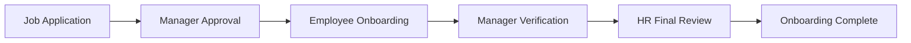

# Employee Onboarding Flow - Complete Guide

## Overview
The Hotel Employee Onboarding System implements a three-phase workflow ensuring federal compliance while maintaining excellent user experience.

## Three-Phase Workflow



## Phase 1: Employee Self-Service

### Step 1: Welcome
- **Component**: `WelcomeStep.tsx`
- **Purpose**: Introduction and consent
- **Data Collected**: Language preference, consent acknowledgment

### Step 2: Personal Information
- **Component**: `PersonalInfoStep.tsx`
- **Purpose**: Basic employee information
- **Data Collected**:
  - Full name (used across ALL documents)
  - Date of birth
  - SSN (encrypted)
  - Contact information
  - Emergency contacts
- **Validation**: SSN format, age verification

### Step 3: Job Details
- **Component**: `JobDetailsStep.tsx`
- **Purpose**: Display assigned position
- **Data**: Read-only from application approval
  - Department
  - Position
  - Start date
  - Reporting manager

### Step 4: I-9 Section 1 ⚖️
- **Component**: `I9Section1Step.tsx`
- **Federal Requirement**: Must complete by first day of work
- **Data Collected**:
  - Citizenship/immigration status
  - Work authorization
  - Alien/USCIS numbers (if applicable)
  - Digital signature
- **Compliance**: USCIS Form I-9 (11/14/23 edition)

### Step 5: W-4 Tax Form ⚖️
- **Component**: `W4FormStep.tsx`
- **Federal Requirement**: IRS Form W-4 (2025)
- **Data Collected**:
  - Filing status
  - Exemptions
  - Additional withholding
  - Digital signature
- **Validation**: IRS business rules

### Step 6: Direct Deposit
- **Component**: `DirectDepositStep.tsx`
- **Data Collected**:
  - Bank name
  - Account type
  - Routing number
  - Account number
- **Security**: Field-level encryption

### Step 7: Health Insurance
- **Component**: `HealthInsuranceStep.tsx`
- **Data Collected**:
  - Enrollment decision
  - Plan selection
  - Dependent information
  - Beneficiaries

### Step 8: Company Policies
- **Component**: `CompanyPoliciesStep.tsx`
- **Documents Presented**:
  - Employee handbook
  - Code of conduct
  - Safety policies
- **Requirement**: Digital acknowledgment signature

### Step 9: Human Trafficking Awareness ⚖️
- **Component**: `TraffickingAwarenessStep.tsx`
- **Federal Requirement**: Hospitality industry compliance
- **Content**: 
  - Awareness training
  - Hotline information (1-888-373-7888)
  - Digital signature acknowledgment

### Step 10: Weapons Policy
- **Component**: `WeaponsPolicyStep.tsx`
- **Content**: Property-specific weapons policy
- **Requirement**: Digital acknowledgment

### Step 11: Background Check Authorization
- **Component**: `BackgroundCheckStep.tsx`
- **Authorization For**:
  - Criminal history
  - Employment verification
  - Education verification
- **Compliance**: FCRA requirements

### Step 12: Document Upload
- **Component**: `DocumentUploadStep.tsx`
- **Required Documents**:
  - Photo ID (driver's license/passport)
  - Social Security card
  - Work authorization (if applicable)
  - Voided check (for direct deposit)
- **OCR Processing**: Google Document AI only

### Step 13: Final Review & Sign
- **Component**: `FinalReviewStep.tsx`
- **Actions**:
  - Review all entered information
  - Make corrections if needed
  - Final digital signature
  - Generate PDF package

## Phase 2: Manager Review

### Step 14: Manager Dashboard Alert
- **Component**: `ManagerDashboard.tsx`
- **Notification**: Real-time WebSocket
- **Actions Available**:
  - Review employee submission
  - Request corrections
  - Proceed to I-9 Section 2

### Step 15: I-9 Section 2 ⚖️
- **Component**: `I9Section2Step.tsx`
- **Federal Requirement**: Within 3 business days of start
- **Manager Responsibilities**:
  - Physical document inspection
  - Document details entry
  - Employer certification signature
- **Compliance**: E-Verify submission

### Step 16: Manager Approval
- **Actions**:
  - Approve and forward to HR
  - Request employee corrections
  - Add notes for HR

## Phase 3: HR Final Review

### Step 17: HR Dashboard Review
- **Component**: `HRDashboard.tsx`
- **Visibility**: All employees across properties
- **Actions**:
  - Compliance verification
  - Document completeness check
  - System integration

### Step 18: Final HR Approval
- **Compliance Checks**:
  - I-9 deadlines met
  - W-4 current year form
  - All signatures captured
  - Required documents uploaded
- **Integration**:
  - Payroll system
  - Benefits enrollment
  - Access provisioning

## Data Flow & Storage

### Session Storage (Frontend)
```javascript
// Each step saves to session
sessionStorage.setItem('onboarding_personal_info_data', JSON.stringify({
  formData: {...},
  timestamp: new Date().toISOString()
}));
```

### Database Storage (Backend)
```sql
-- Onboarding progress tracked
onboarding_sessions (
  id, employee_id, current_step, progress_percentage,
  completed_steps[], form_data, created_at, expires_at
)

-- Signed documents stored
signed_documents (
  id, employee_id, document_type, pdf_url, 
  signature_data, signed_at, metadata
)
```

## Signature Flow

### Integrated Review Pattern
Each form with signature requirements follows:
1. Form completion
2. Review within same component
3. Digital signature capture
4. PDF generation with signature placement
5. Storage in Supabase

### Signature Coordinates (Standardized)
```javascript
// Frontend (pdf-lib) - bottom-left origin
W4: { x: 150, y: 142 }
I9_Employee: { x: 350, y: 142 }
I9_Employer: { x: 350, y: 242 }

// Backend (PyMuPDF) - must match exactly
W4: { x: 150, y: 650 }  // 792 - 142
I9_Employee: { x: 350, y: 650 }
I9_Employer: { x: 350, y: 550 }
```

## Real-time Notifications

### WebSocket Events
```javascript
// New onboarding started
{
  type: "onboarding_started",
  employee_id: "xxx",
  property_id: "xxx"
}

// Step completed
{
  type: "step_completed",
  step: "i9_section1",
  progress: 45
}

// Manager action required
{
  type: "manager_action_required",
  action: "i9_section2_verification",
  employee_id: "xxx"
}
```

## Compliance Tracking

### Automatic Deadline Monitoring
- I-9 Section 1: Red alert if not completed by start date
- I-9 Section 2: Yellow warning at 2 days, red at 3 days
- Document expiration: 30-day advance warnings

### Audit Trail
Every action logged with:
- User ID
- Timestamp
- IP address
- Action type
- Previous/new values

## Error Recovery

### Session Expiration
- 7-day token for employees
- Progress auto-saved to session storage
- Can resume from last completed step

### Network Failures
- Optimistic UI updates
- Retry with exponential backoff
- Queue for offline capability

## Multi-language Support

### Currently Supported
- English (en)
- Spanish (es)

### Implementation
```javascript
// Each component checks language
const { t } = useTranslation(language);
<label>{t('personal_info.first_name')}</label>
```

## Security Measures

### Data Protection
- TLS/HTTPS required
- JWT authentication
- Field-level encryption for PII
- Session timeout after 24 hours

### Compliance
- GDPR right to deletion
- CCPA compliance
- HIPAA considerations for health data
- E-Verify requirements

## Testing Checklist

### Employee Flow
- [ ] Complete all 13 steps
- [ ] Signature capture works
- [ ] PDFs generate correctly
- [ ] Session persistence works
- [ ] Multi-language toggles

### Manager Flow  
- [ ] Receives notifications
- [ ] Can complete I-9 Section 2
- [ ] Property isolation enforced

### HR Flow
- [ ] Sees all properties
- [ ] Compliance warnings appear
- [ ] Can generate reports

### Federal Compliance
- [ ] I-9 deadlines tracked
- [ ] W-4 current year
- [ ] Digital signatures valid
- [ ] Document retention policy